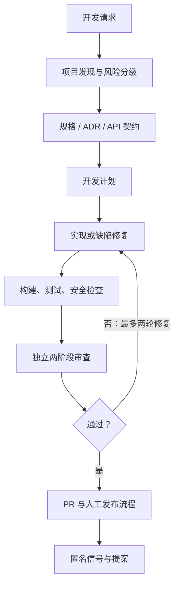

# Java/Spring 全流程 Copilot Skill 体系设计（中文版）

## 总体原则

这套体系不把模型当成固定流程执行器，而是将其作为具备规划和排障能力的工程协作者。Guide 只定义“何时使用、目标、验收标准、边界”；模型自行组织过程。可重复判断由编译器、测试、扫描器、Hook 与 CI 产出事实。

## 五层结构

| 层 | 职责 | 工件 |
|---|---|---|
| 调度层 | 识别任务、选择 Guide、维护状态与审批边界 | `spring-orchestrator`、全局指令 |
| 引导层 | 目标、验收、输入输出和限制 | 11 个 Guide、专项规则、模板 |
| 执行层 | 编码、测试、迁移与文档 | 主 Agent、临时执行 Agent、脚本 |
| 检查层 | 客观质量事实与阻断 | Hook、Maven/Gradle、CI、扫描器 |
| 演进层 | 信号归纳、规则精简和受控提案 | `evolution-runner`、signals、proposals |

## 11 个 Guide

1. `spring-discovery`：项目画像。
2. `requirements-to-spec`：需求与验收标准。
3. `api-contract-builder`：OpenAPI/事件契约与兼容性。
4. `spring-architecture`：ADR、模块、事务与安全边界。
5. `dev-planner`：独立验证的 Phase。
6. `spring-builder`：符合 Spring 约定的实现。
7. `database-migration`：Flyway/Liquibase 与安全发布。
8. `bug-fixer`：证据驱动修复。
9. `code-review`：Stage 1 做对了吗、Stage 2 做好了吗。
10. `release-builder`：制品、隐私审计、回滚准备。
11. `evolution-engine`：反馈归纳、规则新增/退休提案。

## 深度知识与上下文控制

每个 Guide 的 `SKILL.md` 是短契约，只在所有任务中加载：触发条件、目标、验收和边界。复杂场景再按需加载同目录 `references/`：例如 API Guide 加载 HTTP/事件契约标准，迁移 Guide 加载扩展/收缩发布手册，审查 Guide 加载两阶段检查表。这样既避免“把过程写死”限制模型，也避免让模型在处理简单任务时被几千行规则稀释注意力。

跨 Guide 的长期标准位于 `standards/`：安全威胁建模、测试真实性、可观测性/SLO、质量门禁和治理。它们是企业规则的权威来源，项目特定的值仍以 `project-profile.yaml`、ADR 和规格为准。

## 角色隔离

- 主 Agent 负责编排与证据收集，但不能批准高风险操作。
- `code-reviewer` 是独立上下文，只审查、不改代码；Stage 1 阻断时不进入 Stage 2。
- `evolution-runner` 只写提案，不能直接修改生效规则。
- 临时执行 Agent 只在真正需要隔离或并行时创建，不能自行提交或继续派生 Agent。

## 服务与 Deployment 边界

默认采用“一个业务聚合的完整生命周期，一个 Spring 服务，一个 API Deployment”：创建、查询、修改、删除/归档、状态转换、权限、审计和数据所有权放在同一服务。Deployment 可以有多个 Pod 副本；读模型、缓存、Command/Query 代码分层不构成服务拆分。

禁止按 CRUD、Controller、表或前端页面拆服务。出现独立 Worker、读写分离、合规隔离、独立 SLO 或独立团队所有权时，必须以真实指标或组织/合规事实为证据，完成 ADR 与服务边界模板，并定义数据、事件、兼容性和回退策略。详细规则见 [服务边界与单 Deployment 规则](../standards/service-boundary-and-deployment.md)。

## 状态、证据与自主目标

任务状态依次为 `DISCOVERED → SPECIFIED → PLANNED → IMPLEMENTING → VERIFIED → REVIEWED → READY_FOR_PR → RELEASED`。每个状态有源文档、命令、输出、审查或审批证据。

自主目标限定在一个可独立验收 Phase，必须列出交付物、实际验证命令、独立审查 PASS、可修改范围、禁止项与停止条件。需求访谈、架构取舍、生产操作和不可逆迁移不能交给自主执行。

## 企业收紧边界

- 禁止自动推送、合并、发布、部署、端口清理和进程终止。
- 不可逆迁移、生产数据、权限和密钥变更必须人工批准。
- 规则的新增、修改、删除全部通过 PR 与 Code Owner；项目偏好不得污染团队基线。
- 信号只含结构化匿名数据，不含源码和用户内容。
