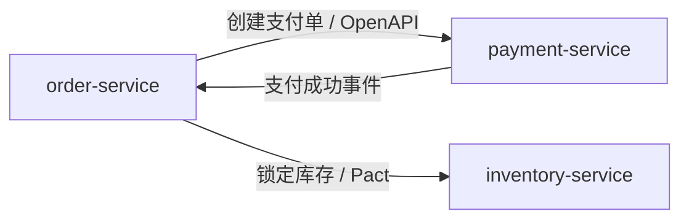

# Workspace 服务地图

> 适用场景：monorepo 或虚拟 monorepo。复制到目标 workspace 根目录并重命名为 `workspace-map.md`。本文件是 Agent 识别跨服务影响面的入口，不替代每个服务的 `SERVICE.md`。

## Workspace 基本信息

- Workspace 名称：
- 仓库形态：monorepo / 虚拟 monorepo / 混合
- 根目录：
- 默认分支：
- 主要语言与运行时：
- 统一构建入口：
- 全局验证命令：

## 服务清单

| 服务 | 路径 | 业务职责 | 数据所有权 | Deployment | Owner | 修改前必须阅读 |
|---|---|---|---|---|---|---|
| order-service | `services/order-service` | 订单生命周期 | `orders`, `order_items` | `order-api` | @team-order | `services/order-service/SERVICE.md` |
| payment-service | `services/payment-service` | 支付与退款 | `payments`, `refunds` | `payment-api` | @team-payment | `services/payment-service/SERVICE.md` |

## 服务协作图

## 跨服务契约索引

| 调用方 | 提供方 | 协议类型 | 契约位置 | 验证命令 |
|---|---|---|---|---|
| order-service | payment-service | OpenAPI | `services/payment-service/openapi.yaml` | `cd services/order-service && ./mvnw test -Dgroups=contract` |
| order-service | inventory-service | Pact | `services/order-service/pact/order-inventory.json` | `cd services/inventory-service && ./mvnw pact:verify` |

## 共享资源与禁止共享项

允许共享：

- OpenAPI、AsyncAPI、Proto、JSON Schema。
- 只包含 DTO/schema 的 contract 包。
- 统一错误码、trace id、认证头约定。

禁止共享：

- JPA Entity。
- Repository/Mapper。
- 业务 Service。
- 可写数据库连接。
- 隐式状态机或权限判断逻辑。

## User Story 影响面记录

| User Story | 直接服务 | 间接服务 | 契约影响 | 数据影响 | 必跑验证 |
|---|---|---|---|---|---|
| 例：下单时锁库存并创建支付单 | order-service | inventory-service, payment-service | 新增库存锁定失败错误码 | 无 | order 单测、inventory provider pact、payment mock 测试 |

## Agent 工作规则

1. 先读取本文件，再读取相关服务的 `SERVICE.md`。
2. 不确定服务边界时，先提出服务影响面，不直接改代码。
3. 涉及服务间字段、错误码、事件或状态变化时，先更新契约。
4. 无法启动完整环境时，使用 mock server、contract test 或 provider verification。
5. 完成后在 PR 中列出修改了哪些服务、契约和验证命令。
